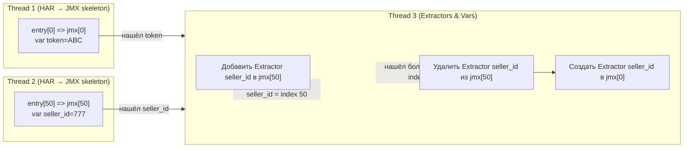

Окей, давай разберём это детально, чтобы было понятно, почему `first_seen_index` гарантирует правильное место для Extractor, даже при параллельной обработке HAR с разных концов.

---

## 1️⃣ Что мы храним в пуле переменных

Каждая переменная хранится так:

```cpp
struct Variable {
    string value;                   // например "ABC"
    size_t first_seen_index;         // индекс entry, где впервые встретили это значение в response
    bool from_response;              // true если value пришло из response
    atomic_bool extractor_created;   // чтобы Extractor добавлялся только один раз
};
```

* `first_seen_index` — это **entry.index**, где переменная впервые встретилась в **response**, а не в request.
* Даже если другой поток встретит это значение раньше (например в request), `first_seen_index` не меняется.

---

## 2️⃣ Пример

Допустим:

* HAR entries:

```
entry[0]  request: ...   response: token=ABC
entry[100] request: auth=ABC  response: ...
```

* Thread 1 начинает с entry[0]
* Thread 2 начинает с entry[100]

**Что происходит:**

1. Thread 2 видит `token=ABC` в request → пытается добавить в пул:

```cpp
insert_if_not_exists(variable_pool, "token", {
    value="ABC",
    first_seen_index=100,
    from_response=false,
    extractor_created=false
});
```

2. Thread 1 видит `token=ABC` в response → пытается добавить в пул:

```cpp
insert_if_not_exists(variable_pool, "token", {
    value="ABC",
    first_seen_index=0,  // entry[0]
    from_response=true,
    extractor_created=false
});
```

* Здесь важно использовать **atomic insert / compare-and-swap**:

  * Если переменная уже есть, не перезаписываем `first_seen_index`, **если существующая запись пришла из response**, или берем **минимум(entry_index)** среди всех встреч в response.
* В итоге пул будет содержать:

```cpp
variable_pool["token"] = {
    value="ABC",
    first_seen_index=0,
    from_response=true,
    extractor_created=false
};
```

---

## 3️⃣ Добавление Extractor

* Thread 3 проверяет пул:

```cpp
Variable &var = variable_pool["token"];
if (var.from_response && !var.extractor_created) {
    lock(jmx[var.first_seen_index].mutex);
    add_extractor(jmx[var.first_seen_index], var);
    var.extractor_created = true;
    unlock(jmx[var.first_seen_index].mutex);
}
```

* **Важно:** мы используем `var.first_seen_index` → всегда точка, где переменная впервые встретилась в response.

* Thread 2 не может создать Extractor для entry[100], потому что:

```cpp
var.extractor_created == false // ещё нет, но first_seen_index == 0
lock(jmx[0].mutex) // блокируем jmx[0], а не jmx[100]
```

* Таким образом Extractor добавляется только в **jmx[0]**, а не в jmx[100].

---

## 4️⃣ Подстановка `${name}` в других Sampler

* После того как Extractor создан в jmx[first_seen_index], можно безопасно подставлять `${name}` в других Sampler:

```cpp
for each entry.index > first_seen_index:
    replace_value_in_skeleton(entry.index, var.value, "${"+var.name+"}")
```

* Можно делать параллельно, потоки могут свободно заменять, потому что Extractor уже создан для источника.

---

✅ **Итог:**

* `first_seen_index` — это **фиксированное место**, где переменная впервые встретилась в response.
* Даже если другой поток встретит значение раньше по обработке (но в request), Extractor будет добавлен **только в Sampler с first_seen_index**.
* `atomic_bool extractor_created` гарантирует, что Extractor добавится только один раз.

---

Если хочешь, я могу нарисовать **цветную схему с двумя потоками, Skeleton Sampler, пул переменных и Extractor**, где показано, как Thread 2 встречает переменную позже по index, но Extractor всё равно добавляется в entry[0].

Хочешь, чтобы я сделал схему?


Да, эта идея рабочая и часто применяется, чтобы **гарантировать правильное место для Extractor**, даже если переменная была “поймана” в другом потоке позже. Давай разберём детально.

---

## 1️⃣ Концепция

* Для каждой переменной в пуле хранить:

```cpp
struct Variable {
    string value;
    size_t first_seen_index;        // где сейчас стоит Extractor
    bool from_response;             // пришло из response
    atomic_bool extractor_created;  // был ли создан Extractor
};
```

* Когда поток встречает переменную в response:

1. Сравнивает текущий `entry.index` с `first_seen_index` из пула.

2. Если текущий `entry.index < first_seen_index` → переменная впервые встретилась **раньше**, чем считалось.

   * Нужно перенести Extractor:

     1. Удаляем Extractor из `jmx[first_seen_index]`
     2. Создаём Extractor в `jmx[entry.index]`
     3. Обновляем `first_seen_index = entry.index` в пуле

3. Если текущий `entry.index >= first_seen_index` → ничего не делаем (Extractor уже в нужном месте).

---

## 2️⃣ Пример

Допустим:

* HAR: entry[0], entry[50], entry[100]
* Поток 2 встретил `seller_id=777` в entry[50] → создал Extractor в `jmx[50]`, `first_seen_index = 50`
* Поток 1 встретил `seller_id=777` в entry[0] → current index 0 < first_seen_index (50)

Тогда:

1. Удаляем Extractor из `jmx[50]`
2. Создаём Extractor в `jmx[0]`
3. Обновляем `variable_pool["seller_id"].first_seen_index = 0`
4. Подставляем `${seller_id}` в jmx[50..]

✅ В итоге Extractor всегда находится **там, где переменная впервые пришла из response**, даже при параллельной обработке.

---

## 3️⃣ Производительность

* Стоит отметить:

  * Операция “удалить и создать Extractor” **нечастая**, только когда переменная реально встречается раньше, чем считалось
  * Для большинства переменных первый поток действительно встречает их первым → дополнительных операций почти нет
  * Потокобезопасно можно использовать **mutex на каждый Sampler** для удаления/добавления Extractor

* Таким образом, **затраты минимальны**, и это проще, чем пытаться синхронизировать строго по времени между потоками при первом создании Extractor.

---

## 4️⃣ Итог

* Этот метод гарантирует **правильное место для Extractor** независимо от порядка обработки потоками.
* Extractor может “переехать” в более ранний Sampler, если вдруг другая переменная была встречена раньше.
* Параллельная обработка остаётся максимально быстрой и безопасной.

---

Если хочешь, могу нарисовать **схему с двумя потоками, переменной, которая “переезжает” Extractor в более ранний Sampler**, и показать как это работает визуально.

Хочешь, чтобы я сделал такую схему?

