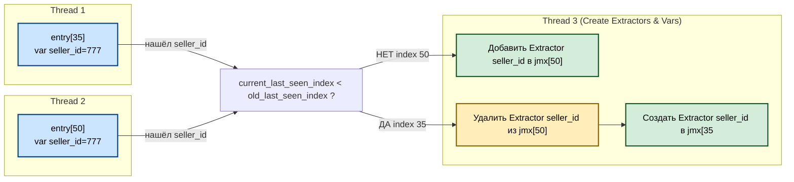

## 1️⃣ Какие есть роли потоков

* **Thread 1 + Thread 2** → читают HAR (с разных концов), создают skeleton JMX и записывают переменные в пул.
* **Thread 3** → отвечает за Extractor и подстановки `${var}`.

---

## 2️⃣ Кто управляет Extractor?

👉 **Extractor’ами управляет именно Thread 3.**
Причины:

* Extractor – это уже **логика JMX**, а не парсинг HAR.
* Нужно, чтобы **все изменения JMX были централизованы**, иначе race condition при редактировании одного и того же Sampler.
* Thread 1/2 должны работать максимально “тупо и быстро” → только skeleton и переменные в пул.

---

## 3️⃣ Логика удаления и переноса Extractor в Thread 3

Алгоритм:

1. Thread 1 или 2 добавляют переменную в `variable_pool` (с `first_seen_index`).
2. Если другая встреча переменной в response имеет меньший `entry.index`:

   * Thread 3 обнаруживает, что **новый first_seen_index < старого**.
   * Он берёт lock на старый Sampler → удаляет Extractor.
   * Берёт lock на новый Sampler → создаёт Extractor.
   * Обновляет `variable_pool.first_seen_index`.

---

## 4️⃣ Как это работает в реальности

* Thread 1 встречает `seller_id` в entry[0]
* Thread 2 ранее уже записал `seller_id` из entry[50]
* В `variable_pool` лежит:

```cpp
seller_id: {
  value="777",
  first_seen_index=50,
  extractor_created=true
}
```

* Thread 3 замечает:

  * Новая запись пришла с index=0 < 50
  * Значит, Extractor должен быть **перенесён**

Действия:

```cpp
lock(jmx[50].mutex);
remove_extractor(jmx[50], "seller_id");
unlock(jmx[50].mutex);

lock(jmx[0].mutex);
add_extractor(jmx[0], "seller_id");
unlock(jmx[0].mutex);

variable_pool["seller_id"].first_seen_index = 0;
```

---

## 5️⃣ Итог

* ✅ **Thread 1 и 2** → быстрый парсинг HAR + запись переменных в пул
* ✅ **Thread 3** → занимается Extractor: добавление, удаление, перенос, подстановки `${var}`
* ✅ Перенос Extractor в более ранний Sampler всегда безопасен, потому что всё это делает **один поток**

---

Хочешь, я нарисую ещё одну **схему с тремя потоками**, где показано:

* Потоки 1/2 только добавляют переменные
* Thread 3 следит за `first_seen_index` и переносит Extractor при необходимости


