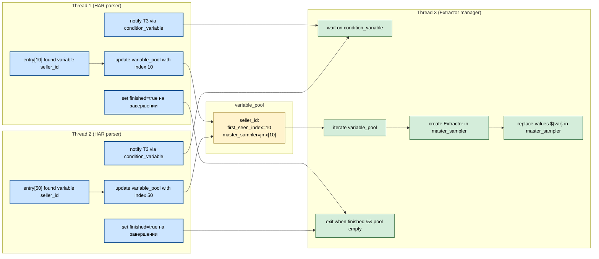

### 🔹 Пример структуры и кода

```cpp
struct MasterVariable {
    std::string name;
    std::atomic<int> first_seen_index{INT_MAX};
    std::atomic<Sampler*> master_sampler{nullptr};
};

// глобальный пул
std::unordered_map<std::string, MasterVariable> variable_pool;
std::mutex variable_pool_mtx;

// Thread 1/2: находят переменные, обновляют пул
void on_found_variable(const std::string &name, int index, Sampler* s) {
    std::lock_guard<std::mutex> lg(variable_pool_mtx);
    auto &mv = variable_pool[name];
    if(index < mv.first_seen_index) {
        mv.first_seen_index = index;
        mv.master_sampler = s;
    }
}

// Thread 3: финальный проход
void reconcile_extractors() {
    for(auto &kv : variable_pool) {
        auto &mv = kv.second;
        Sampler* master = mv.master_sampler.load();
        if(master) {
            master->add_extractor(mv.name);      // создаём Extractor
            master->replace_values("${" + mv.name + "}", mv.name); // подставляем переменную
        }
    }
}
```

---

### 🔹 Преимущества такого подхода

* ✅ Нет гонок на создание/удаление Extractor’ов.
* ✅ Thread 1/2 максимально лёгкие и быстрые — только сбор информации.
* ✅ Thread 3 управляет **всей логикой включения Extractor** и подстановки переменных.
* ✅ Память минимальна — не нужно хранить disabled‑копии или все Sampler’ы.

---

💡 **Рекомендации для улучшения**:

* 🧵 Сделать Thread 3 ленивым: запускать после окончания T1/T2 или периодически, чтобы поддерживать master актуальным.
* ⚡ Если данные приходят динамически, использовать **atomic snapshot + versioning** для стабильности.
* 🧰 Для масштабирования — sharded variable_pool или lock-free структуры.
* 🔍 Логировать, какой sampler стал master, чтобы отлавливать неожиданные перескакивания.

Если хочешь, я могу сразу написать **полностью рабочий C++ пример с потоками**, где T1/T2 собирают данные, а T3 динамически создаёт Extractor и подставляет `${var}` — готовый к запуску.

Хочешь, чтобы я это сделал?


</br>
</br>
</br>
</br>
</br>

---

Ага, теперь ключевой вопрос — **синхронизация завершения T3 относительно T1/T2**. 🔑

Основная идея: **T3 не должен завершаться, пока T1/T2 ещё могут добавить новые переменные или обновить master_sampler**. Есть несколько надёжных паттернов, как это организовать:

---

### 1️⃣ Флаг завершения потоков (simplest)

* Thread 1 и 2 при старте/конце работы выставляют atomic-флаг или уменьшают счётчик active_workers.
* T3 периодически проверяет пул и счётчик:

```cpp
std::atomic<int> active_workers = 2; // T1 + T2

// T1/T2 перед выходом
active_workers--;

// T3 loop
while(active_workers > 0 || !variable_pool.empty()) {
    reconcile_extractors();
    std::this_thread::sleep_for(std::chrono::milliseconds(10));
}
```

**Плюсы:** просто, безопасно, нет блокировок.
**Минусы:** T3 может делать лишние проходы (если данные уже собраны, но флаг ещё не снижен).

---

### 2️⃣ Использовать *condition_variable* (лучше для realtime)

* T1/T2 после добавления переменной **notifies T3**, что есть новые данные.
* T3 ждёт сигнала или таймаут, затем обрабатывает переменные.
* После завершения T1/T2 и обработки всех данных — T3 завершает цикл.

```cpp
std::mutex mtx;
std::condition_variable cv;
std::atomic<bool> finished = false;

void t1_or_t2() {
    on_found_variable(...);
    cv.notify_one(); // сообщаем T3
    ...
    if(done) finished = true; cv.notify_one();
}

void t3() {
    std::unique_lock<std::mutex> lk(mtx);
    while(!finished) {
        cv.wait_for(lk, std::chrono::milliseconds(50)); // либо event-driven
        reconcile_extractors();
    }
    reconcile_extractors(); // финальный проход
}
```

**Плюсы:** T3 работает только когда есть новые данные, минимальные лишние проходы.
**Минусы:** чуть больше сложность, но контроль над timing лучше.

---

### 3️⃣ Использовать очередь событий (*event-driven*)

* T1/T2 при обнаружении переменной добавляют событие в lock-free очередь (или `concurrent_queue`).
* T3 просто забирает события и обрабатывает их.
* Как только очередь пуста и T1/T2 завершены — T3 выходит.

```cpp
while(!event_q.empty() || active_workers>0) {
    auto ev = event_q.pop();
    process_event(ev);
}
```

**Плюсы:** идеально подходит, если переменных много и события могут приходить динамически.
**Минусы:** нужно немного больше инфраструктуры (очередь + обработка).

---

### 🔹 Как T3 понимает, что Sampler заполнен

* Самый простой способ: **T3 проверяет флаг “master_sampler готов” или non-empty поля/индексы в variable_pool**.
* Если `mv.master_sampler != nullptr` и все ожидаемые переменные имеют свои first_seen_index, значит Sampler можно считать «готовым».
* Для полной надёжности: хранить **atomic counters для каждого Sampler**, увеличиваем при нахождении переменной (T1/T2) и проверяем, что счетчик достиг ожидаемого числа переменных → готов.

---

### 🔹 Итог паттернов для завершения T3

1. **Atomic counter/active_workers** — проще всего, подходит для batch обработки.
2. **Condition variable** — лучше для realtime, меньше CPU-цикл.
3. **Event queue** — идеально для динамического потока переменных.
4. **Optional per-Sampler counters** — для точного определения «заполненности» Sampler’а.

---

💡 Рекомендации:

* 🧵 Для start/stop проще всего — atomic counter + финальный reconcile.
* ⚡ Если переменные приходят асинхронно — event-driven с condition_variable.
* 🔍 Для больших систем — комбинировать очередь + versioning + debounce, чтобы избежать лишних переключений.

Если хочешь, могу сразу нарисовать **мини-схему Mermaid**, где показано **T1/T2 → variable_pool → T3 и условие завершения**, будет наглядно понятно, как T3 понимает готовность Sampler.

Хочешь такую схему?


Если оценивать **скорость работы и нагрузку на CPU**, то можно разложить так:

---

### 1️⃣ **Atomic counter / active_workers**

* **Скорость:** очень высокая, почти нулевая задержка.
* **CPU:** низкая, если T3 просто делает периодический `while(active_workers>0)` с небольшим sleep.
* **Минус:** может делать лишние проходы, если sleep слишком короткий → чуть больше CPU; если sleep слишком длинный → задержка завершения.

**Вывод:** быстрый и простой, но оптимально подобрать таймаут/спящий интервал. ✅

---

### 2️⃣ **Condition variable**

* **Скорость:** мгновенный wake-up при событии, почти нулевая задержка между T1/T2 и T3.
* **CPU:** минимальная нагрузка, T3 не ждет в цикле, спит до сигнала.
* **Минус:** чуть сложнее в коде, надо правильно уведомлять после каждого изменения.

**Вывод:** для realtime и низкого CPU — лучший вариант. ⚡

---

### 3️⃣ **Event queue**

* **Скорость:** высокая, особенно если очередь lock-free.
* **CPU:** средняя, зависит от того, как реализована очередь (busy-wait vs sleep).
* **Минус:** нужно больше инфраструктуры, сложнее поддерживать порядок и версии.

**Вывод:** лучше для динамических систем с большим количеством переменных. 🏎️

---

### 4️⃣ **Optional per-Sampler counters**

* **Скорость:** средняя, потому что нужно каждый раз проверять все Sampler’ы.
* **CPU:** выше среднего, особенно при большом числе Sampler’ов.
* **Минус:** точное определение готовности, но дороже по ресурсам.

**Вывод:** нужен только если важно точно знать, что каждый Sampler полностью собран. ⚖️

---

### 🔹 Итог по скорости/эффективности

| Паттерн              | CPU нагрузка    | Реакция на события | Сложность   |
| -------------------- | --------------- | ------------------ | ----------- |
| Atomic counter       | низкая/средняя  | зависит от sleep   | очень прост |
| Condition variable   | минимальная     | мгновенная         | средняя     |
| Event queue          | средняя         | высокая            | выше        |
| Per-Sampler counters | средняя/высокая | высокая            | выше        |

**Вывод:**

* **Если цель — скорость и низкая нагрузка CPU:** `condition_variable` + event-driven wake-up.
* **Если нужна простота и batch-процессинг:** `atomic counter / active_workers`.

💡 Совет: для большинства случаев с T1/T2, которые быстро генерируют переменные, **atomic counter + небольшой sleep (~5–10 мс) будет проще и почти так же быстро**, а для realtime-систем с большим потоком переменных лучше `condition_variable`.

---

Если хочешь, я могу сразу показать **мини-схему и код для T3**, где используется **atomic counter и условие завершения**, готовую для запуска.

Хочешь такой пример?


