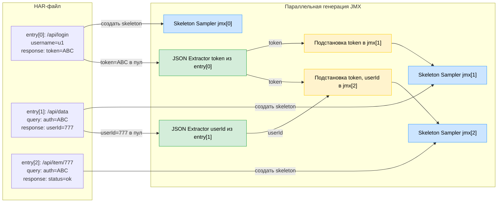

# 🔁 HAR → JMX: Полный план действий

## 1️⃣ Чтение HAR

1. 📂 Открываем HAR-файл и читаем его **entry за entry**.
2. Для каждого entry берём:

   * **Request:** headers, query-параметры, тело (body) — форматы `form`, `json`, `raw`.
   * **Response:** тело ответа (`response.content.text`) — декодируем, если `base64`, парсим JSON/form/plain.

---

## 2️⃣ Сбор переменных

1. 🔍 Ищем пары **key=value** в request и response:

   * Если встречается **ключ key**:

     * Создаём запись в пуле переменных:

       ```text
       variable.name = key
       variable.value = last_seen value
       variable.source = response (если value в response) или request (если только в request)
       ```
   * Если встречается **value без ключа**:

     * Проверяем, встречался ли такой value раньше:

       * ✅ Если да → переиспользуем существующий `var_n`.
       * ❌ Если нет → создаём новый `var_n` (`var_1`, `var_2`, …) и сохраняем:

         ```text
         variable.name = var_n
         variable.value = value
         variable.source = response или request
         ```

---

## 3️⃣ Формирование пула переменных

* Пул хранит все найденные переменные:

```text
variable_pool = [
  {name="token", value="ABC123", source=response},
  {name="userId", value="777", source=response},
  {name="username", value="user1", source=request},
  {name="var_1", value="abcd", source=response/request}
]
```

* 🔹 **last_seen** — для ключей берём последнее значение из response.
* 🔹 Для value без ключа используем `var_n`, переиспользуя при **exact-match**.

---

## 4️⃣ Анализ следующего запроса

* Для каждого нового request HAR:

  * Запоминаем, какие значения уже есть в пуле.
  * **Не меняем HAR!** Просто собираем информацию для генерации JMX: где какие значения будут подставлены как `${name}`.

---

## 5️⃣ Генерация JMX

1. ✨ Создаём **HTTP Sampler** для каждого request:

   * URL, headers, body — копируем из HAR.
2. 🔹 **Подстановка переменных в Sampler (только при экспорте в JMX):**

   * Если value совпадает с переменной из **response** → `${name}`
   * Если value совпадает с переменной только из **request** → `${name}` (из UserDefinedVariables)
   * Заменяем **везде:** URL, query, headers, body, URL path (например `/users/777` → `/users/${var_2}`)
3. 🛠️ **Добавляем Extractors** для переменных из response:

   * JSON Extractor / Body Extractor, чтобы динамически получать значения при тесте.
4. 🗂️ **Добавляем UserDefinedVariables** для переменных, найденных только в request:

   * Например `username`, `password` и другие значения без response.

---

## 6️⃣ Резюме правил

* 🔹 **last_seen** — для ключей, если value меняется, берём последнее из response.
* 🔹 **var_n** — для value без ключа; переиспользуем при exact-match.
* 🔹 Замена на `${name}` делается **только в JMX**, HAR остаётся чистым.
* 🔹 **Из response → Extractor**, только из request → UserDefinedVariables.
* 🔹 Заменяем все вхождения value: query, body, headers, URL path.

---

## 7️⃣ Пример

**HAR Entry 1:**

* Request: `/api/login` body `{"username":"user1","password":"pass1"}`
* Response: `{"token":"ABC123","userId":777}`

**Пул переменных:**

* token=ABC123 (source=response)
* userId=777 (source=response)
* username=user1 (source=request)
* password=pass1 (source=request)

**HAR Entry 2:**

* Request: `/api/items/777?auth=ABC123`

**JMX Sampler:**

* URL: `/api/items/${userId}?auth=${token}`
* JSON Extractor: token, userId
* UserDefinedVariables: username, password


</br>
</br>
</br>

# 🗂️ Параллельная генерация JMX из HAR (цветная схема)



---

# 🔹 Легенда цветов

* 🔵 **Skeleton Sampler** → создаётся сразу для каждого entry, без переменных.
* 🟢 **Extractor (JSON/Body)** → динамически добавляется в Sampler, откуда пришёл response.
* 🟠 **Подстановка `${name}`** → в Sampler, который использует значение из пула переменных.

---

# 🔹 Как работает

1. **entry[0]** → response: `token=ABC` → Skeleton jmx[0] создан, добавлен JSON Extractor token.
2. **entry[1]** → request: `auth=ABC` → Skeleton jmx[1] создан, `${token}` подставляется в jmx[1], Extractor уже готов в jmx[0].
3. **entry[1]** response: `userId=777` → добавляется JSON Extractor в jmx[1].
4. **entry[2]** → request: использует `${token}` и `${userId}` → Skeleton jmx[2] создан, подставляем переменные.

---

Эта схема отражает **реальный поток параллельной генерации JMX**, где Skeleton Sampler создаются сразу, пул переменных обновляется по мере чтения HAR, Extractor добавляется динамически, а подстановки `${name}` появляются в Sampler в нужных местах.

---

Если хочешь, могу сделать **ещё “расширенный вариант” с вар_переменными (`var_n`) и их подстановкой**, чтобы полностью покрыть все сценарии HAR → JMX.

Хочешь, чтобы я сделал расширенный вариант?
